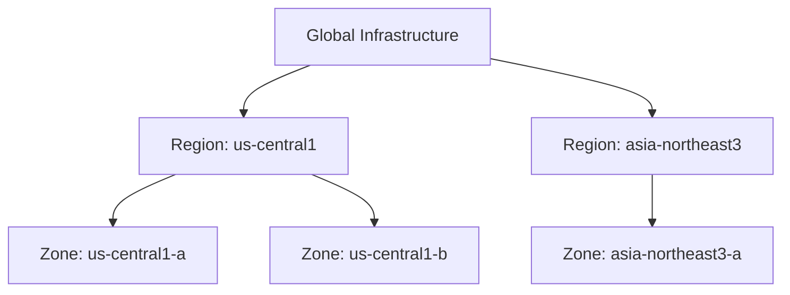
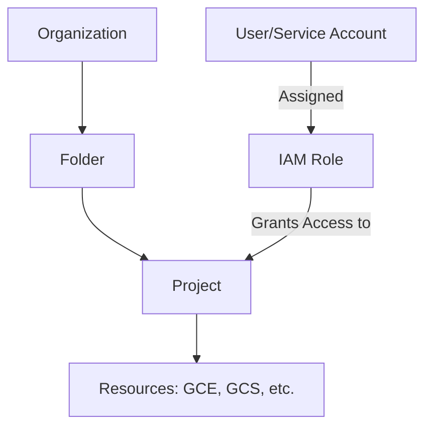
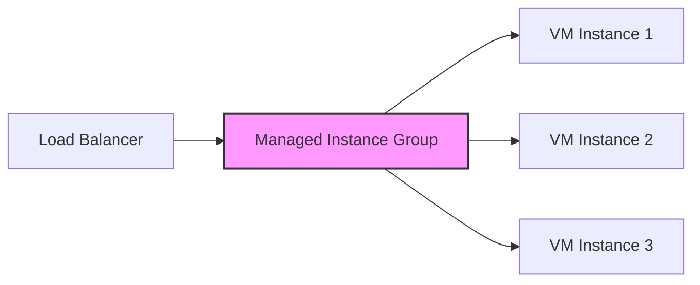

# Google Cloud Professional Cloud Architect Master Cheat Sheet - Part 1

# Google's Infrastructure

### 🌐 English
- **Backbone**: Global, meshed backbone network to interconnect data centers and deliver traffic to Edge Points of Presence (POPs).
- **PoPs**: 70+ edge PoPs in 33 countries.
- **Edge Caching**: Caching platform sitting on top of infrastructure.
- **Regions**: Specific geographical locations (e.g., us-central1). Regional resources are available to any zone in the region.
- **Zones**: Isolated locations within a region (e.g., us-central1-a).

### 🇰🇷 한국어
- **백본 (Backbone)**: 데이터 센터를 상호 연결하고 Edge PoP로 트래픽을 전달하는 글로벌 메시 백본 네트워크입니다.
- **PoP (Points of Presence)**: 33개국에 70개 이상의 에지 PoP가 있습니다.
- **에지 캐싱 (Edge Caching)**: 인프라 위에 위치한 캐싱 플랫폼입니다.
- **리전 (Regions)**: 리소스를 실행할 수 있는 특정 지리적 위치(예: us-central1)입니다. 리전 리소스는 해당 리전 내의 모든 영역에서 사용할 수 있습니다.
- **영역 (Zones)**: 리전 내의 격리된 위치(예: us-central1-a)입니다.

### 📊 Diagram

### ❓ Q&A
- **Q:** What is the main difference between a Region and a Zone?
- **Q (한글):** 리전(Region)과 영역(Zone)의 가장 큰 차이점은 무엇인가요?
- **A:** A Region is a specific geographical area containing multiple Zones, which are isolated failure domains.
- **A (한글):** 리전은 여러 영역을 포함하는 특정 지리적 위치이며, 영역은 리전 내의 격리된 장애 도메인입니다.

---

# GCP Networking Fundamentals

### 🌐 English
- **Pricing**: Ingress is free, Egress is charged. Sustained-use discounts apply automatically up to 30%.
- **Security**: All data is encrypted at rest. BeyondCorp security model shifts access from perimeter to identity.

### 🇰🇷 한국어
- **가격 정책**: 수신(Ingress) 트래픽은 무료이며, 송신(Egress) 트래픽은 유료입니다. 지속 사용 할인(Sustained-use discounts)은 자동으로 적용되어 최대 30%까지 할인됩니다.
- **보안**: 저장된 모든 데이터는 암호화됩니다(Encryption at rest). BeyondCorp 보안 모델은 네트워크 경계에서 사용자 및 기기 ID로 제어의 중심을 이동합니다.

### ❓ Q&A
- **Q:** How are sustained-use discounts enabled?
- **Q (한글):** 지속 사용 할인은 어떻게 활성화하나요?
- **A:** They are applied automatically; no action is required.
- **A (한글):** 자동으로 적용되므로 별도의 조치가 필요하지 않습니다.

---

# Resource Hierarchy & IAM

### 🌐 English
- **Hierarchy**: Organization ➔ Folders ➔ Projects ➔ Resources.
- **IAM**: Members (Who) ➔ Roles (What) ➔ Resources.
- **Service Accounts**: Special accounts for applications, not users.

### 🇰🇷 한국어
- **리소스 계층 구조**: 조직(Organization) ➔ 폴더(Folders) ➔ 프로젝트(Projects) ➔ 리소스(Resources).
- **IAM (ID 및 액세스 관리)**: 구성원(누가) ➔ 역할(무엇을) ➔ 리소스.
- **서비스 계정**: 사용자가 아닌 애플리케이션을 위한 특수 계정입니다.

### 📊 Diagram

### ❓ Q&A
- **Q:** Can a GCP resource belong to multiple projects?
- **Q (한글):** GCP 리소스가 여러 프로젝트에 속할 수 있나요?
- **A:** No, a resource can only have one parent project.
- **A (한글):** 아니요, 리소스는 하나의 상위 프로젝트만 가질 수 있습니다.

---

# Compute Options: GCE

### 🌐 English
- **GCE**: Zonal IaaS VMs.
- **MIGs**: Managed Instance Groups for auto-scaling and high availability.

### 🇰🇷 한국어
- **GCE (Compute Engine)**: 영역(Zonal) 기반의 IaaS 가상 머신입니다.
- **MIG (관리형 인스턴스 그룹)**: 자동 확장(Auto-scaling) 및 고가용성을 위한 관리형 인스턴스 그룹입니다.

### 📊 Diagram

### ❓ Q&A
- **Q:** When should you use an Unmanaged Instance Group?
- **Q (한글):** 비관리형 인스턴스 그룹(Unmanaged Instance Group)은 언제 사용해야 하나요?
- **A:** For dissimilar instances that require load balancing without auto-scaling.
- **A (한글):** 자동 확장 없이 부하 분산(Load balancing)이 필요한 서로 다른 구성의 인스턴스들에 사용합니다.
