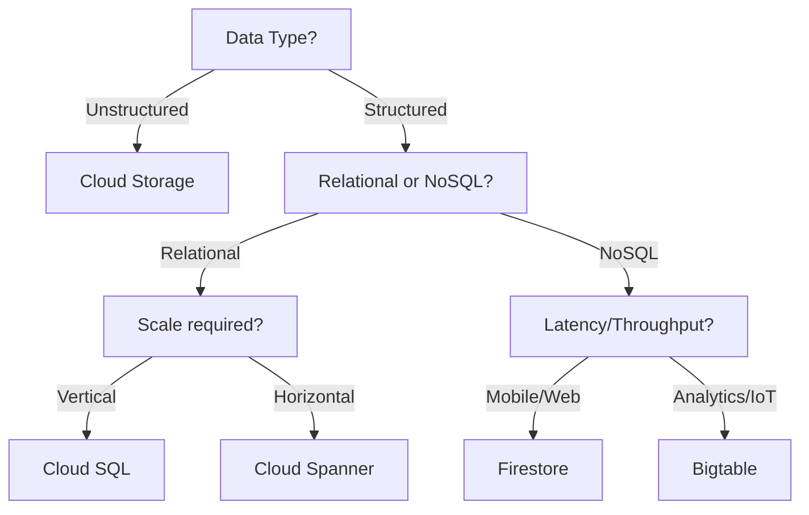
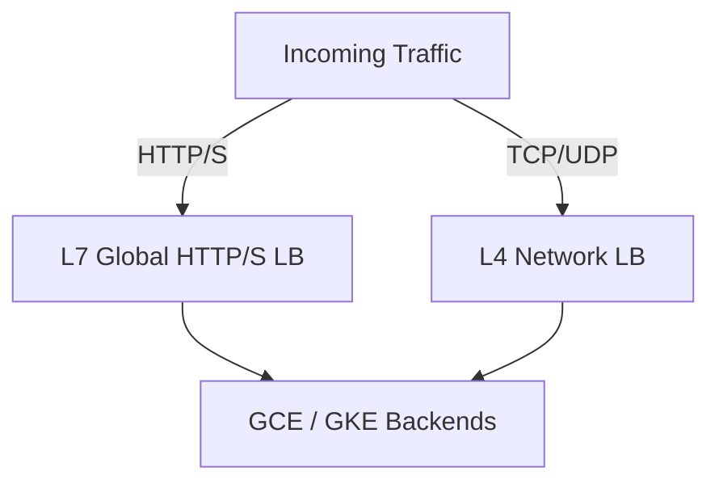

# Google Cloud Professional Cloud Architect Master Cheat Sheet - Part 2

# Compute Options: GKE & App Engine

### 🌐 English
- **GKE**: Managed Kubernetes for containerized apps.
- **App Engine Standard**: Zero-admin, scales to zero. Specific runtimes.
- **App Engine Flexible**: Docker-based, custom runtimes, background processes.

### 🇰🇷 한국어
- **GKE (Kubernetes Engine)**: 컨테이너화된 앱을 위한 관리형 쿠버네티스 서비스입니다.
- **App Engine 표준**: 관리 불필요, 0으로 확장 가능. 특정 런타임만 지원.
- **App Engine 가변**: Docker 기반, 커스텀 런타임 지원, 백그라운드 프로세스 가능.

### ❓ Q&A
- **Q:** What is the main criteria to choose App Engine Flexible over Standard?
- **Q (한글):** App Engine 표준 대신 가변 환경을 선택하는 주요 기준은 무엇인가요?
- **A:** Need for custom runtimes (via Docker) or background processes.
- **A (한글):** (Docker를 통한) 커스텀 런타임이나 백그라운드 프로세스가 필요한 경우입니다.

---

# Storage & Databases

### 🌐 English
- **Cloud Storage**: Object storage (unstructured).
- **Cloud SQL**: Managed relational (MySQL, Postgres).
- **Cloud Spanner**: Horizontally scalable, strongly consistent relational DB.
- **Firestore (Datastore)**: NoSQL document DB.
- **Bigtable**: High-throughput NoSQL for heavy workloads.

### 🇰🇷 한국어
- **Cloud Storage**: 객체 저장소 (비정형 데이터).
- **Cloud SQL**: 관리형 관계형 DB (MySQL, Postgres).
- **Cloud Spanner**: 수평 확장이 가능하고 강력한 일관성을 제공하는 관계형 DB.
- **Firestore (Datastore)**: NoSQL 문서 DB.
- **Bigtable**: 대규모 워크로드를 위한 고처리량 NoSQL DB.

### 📊 Diagram

### ❓ Q&A
- **Q:** When should you choose Cloud Spanner over Cloud SQL?
- **Q (한글):** Cloud SQL 대신 Cloud Spanner를 선택해야 하는 경우는 언제인가요?
- **A:** When you need global scale, horizontal writing capacity, and relational features.
- **A (한글):** 글로벌 규모의 수평적 쓰기 확장성과 관계형 DB 기능이 모두 필요한 경우입니다.

---

# Networking & Load Balancing

### 🌐 English
- **Cloud Load Balancing**: Global vs Regional, Layer 4 vs Layer 7.
- **Cloud CDN**: Edge delivery for HTTP(S) Load Balancer.

### 🇰🇷 한국어
- **부하 분산 (Cloud Load Balancing)**: 글로벌 vs 리전, Layer 4 vs Layer 7.
- **Cloud CDN**: HTTP(S) 부하 분산기를 위한 에지 캐싱 전송 서비스입니다.

### 📊 Diagram

### ❓ Q&A
- **Q:** Which Load Balancer is required to use Cloud CDN?
- **Q (한글):** Cloud CDN을 사용하려면 어떤 부하 분산기가 필요한가요?
- **A:** Global HTTP(S) Load Balancer.
- **A (한글):** 글로벌 HTTP(S) 부하 분산기입니다.
