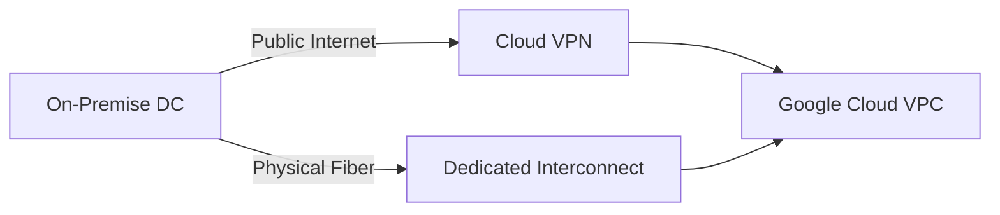
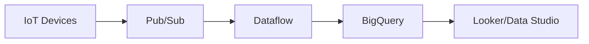

# Google Cloud Professional Cloud Architect Master Cheat Sheet - Part 3

# Hybrid Connectivity

### 🌐 English
- **Cloud VPN**: IPsec over public internet. 99.9% SLA.
- **Dedicated Interconnect**: Direct physical connection. 99.99% SLA (with redundancy).

### 🇰🇷 한국어
- **Cloud VPN**: 공용 인터넷을 통한 IPsec VPN입니다. 99.9% SLA.
- **Dedicated Interconnect**: 직접적인 물리적 연결입니다. (이중화 구성 시) 99.99% SLA.

### 📊 Diagram

### ❓ Q&A
- **Q:** What is the recommended SLA for Dedicated Interconnect?
- **Q (한글):** Dedicated Interconnect의 권장 SLA는 어떻게 되나요?
- **A:** 99.99%, which requires configuring redundant connections.
- **A (한글):** 99.99% 이며, 이를 위해서는 이중화 연결 구성이 필요합니다.

---

# Big Data & Analytics

### 🌐 English
- **Pub/Sub**: Global messaging glue.
- **Dataflow**: Apache Beam for stream/batch processing.
- **Dataproc**: Managed Hadoop/Spark.
- **BigQuery**: Serverless data warehouse.

### 🇰🇷 한국어
- **Pub/Sub**: 글로벌 메시징 허브 역할을 합니다.
- **Dataflow**: 스트림 및 배치 처리를 위한 Apache Beam 기반 서비스입니다.
- **Dataproc**: 관리형 Hadoop/Spark 서비스입니다.
- **BigQuery**: 서버리스 데이터 웨어하우스입니다.

### 📊 Diagram

### ❓ Q&A
- **Q:** When should you choose Dataproc over Dataflow?
- **Q (한글):** Dataflow 대신 Dataproc을 선택해야 하는 경우는 언제인가요?
- **A:** To migrate existing Hadoop/Spark workloads without rewriting code.
- **A (한글):** 기존의 Hadoop/Spark 워크로드를 코드 수정 없이 그대로 마이그레이션할 때입니다.

---

# Operations & Management

### 🌐 English
- **Stackdriver (Cloud Operations)**: Monitoring, Logging, Trace, Debugger, Profiler.

### 🇰🇷 한국어
- **Cloud Operations (구 Stackdriver)**: 모니터링, 로깅, 추적, 디버거, 프로파일러 기능이 포함되어 있습니다.

### ❓ Q&A
- **Q:** How can you track application latency across microservices?
- **Q (한글):** 마이크로서비스 전체에서 애플리케이션 지연 시간을 어떻게 추적할 수 있나요?
- **A:** Use Cloud Trace.
- **A (한글):** Cloud Trace를 사용합니다.
