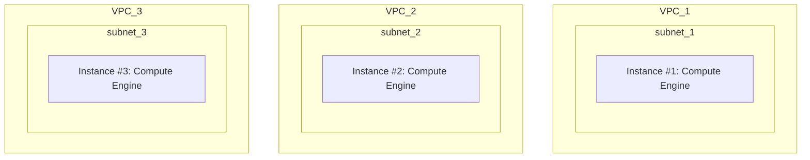

## Exam Professional Cloud Architect topic 1 question 120 discussion

Actual exam question from

Google's
Professional Cloud Architect

Question #: 120
Topic #: 1

[All Professional Cloud Architect Questions]

Your company has a project in Google Cloud with three Virtual Private Clouds (VPCs). There is a Compute Engine instance on each VPC. Network subnets do not overlap and must remain separated. The network configuration is shown below.

### VPC Network Configuration (Mermaid)

Instance #1 is an exception and must communicate directly with both Instance #2 and Instance #3 via internal IPs. How should you accomplish this? 
Suggested Answer: B 🗳️ 

A. Create a cloud router to advertise subnet #2 and subnet #3 to subnet #1.

B. Add two additional NICs to Instance #1 with the following configuration: ג€¢ NIC1 ג—‹ VPC: VPC #2 ג—‹ SUBNETWORK: subnet #2 ג€¢ NIC2 ג—‹ VPC: VPC #3 ג—‹ SUBNETWORK: subnet #3 Update firewall rules to enable traffic between instances.

C. Create two VPN tunnels via CloudVPN: ג€¢ 1 between VPC #1 and VPC #2. ג€¢ 1 between VPC #2 and VPC #3. Update firewall rules to enable traffic between the instances.

D. Peer all three VPCs: ג€¢ Peer VPC #1 with VPC #2. ג€¢ Peer VPC #2 with VPC #3. Update firewall rules to enable traffic between the instances.

**Answer: B**

**Timestamp: June 30, 2021, 5:57 p.m.**

[View on ExamTopics](https://www.examtopics.com/discussions/google/view/56416-exam-professional-cloud-architect-topic-1-question-120/)

----------------------------------------