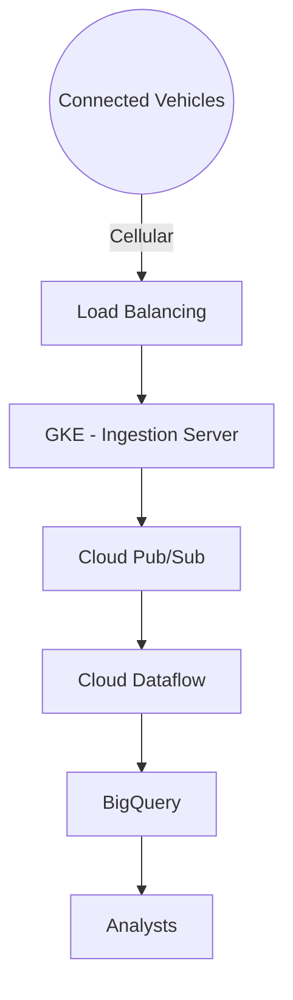
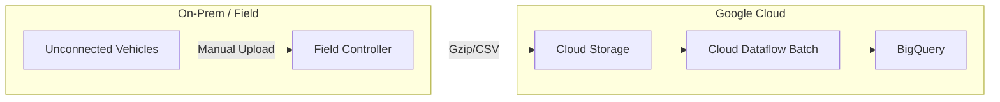
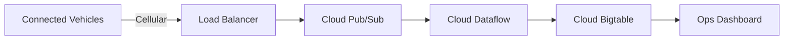

## Exam Professional Cloud Architect topic 8 question 1 discussion

Actual exam question from

Google's
Professional Cloud Architect

Question #: 1
Topic #: 8

[All Professional Cloud Architect Questions]

TerramEarth's CTO wants to use the raw data from connected vehicles to help identify approximately when a vehicle in the field will have a catastrophic failure.You want to allow analysts to centrally query the vehicle data.Which architecture should you recommend?

### Architecture Options (Mermaid)

**A (Recommended)**

**B (Batch)**

**C (Operational)**

**D (Transactional)**

Suggested Answer: A The push endpoint can be a load balancer.A container cluster can be used.Cloud Pub/Sub for Stream AnalyticsReference:https://cloud.google.com/pubsub/https://cloud.google.com/solutions/iot/https://cloud.google.com/solutions/designing-connected-vehicle-platform https://cloud.google.com/solutions/designing-connected-vehicle-platform#data_ingestion http://www.eweek.com/big-data-and-analytics/google-touts-value-of-cloud-iot-core-for-analyzing-connected-car-data https://cloud.google.com/solutions/iot/ 

**Answer: A**

**Timestamp: Dec. 30, 2019, 12:17 p.m.**

[View on ExamTopics](https://www.examtopics.com/discussions/google/view/11084-exam-professional-cloud-architect-topic-8-question-1/)

----------------------------------------